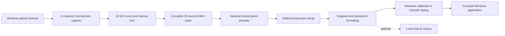

<p align="center">
  
</p>

<h1 align="center">Dictum</h1>

<p align="center">
  Open-source, local-first voice dictation for Windows.
  <br />
  Hold a shortcut, speak naturally, and Dictum inserts polished text wherever your cursor is.
</p>

<p align="center">
  
  
  
  <a href="LICENSE"></a>
</p>

<p align="center">
  <a href="#download-and-install">Install</a> ·
  <a href="#first-run">First run</a> ·
  <a href="#using-dictum">Usage</a> ·
  <a href="#long-dictation">Long dictation</a> ·
  <a href="#build-from-source">Build</a> ·
  <a href="#troubleshooting">Help</a>
</p>

<p align="center">
  <a href="https://github.com/Vkandil/dictum/releases/latest"></a>
</p>

<p align="center"><sub>Free · Windows 10 &amp; 11 · installs in about a minute</sub></p>

> [!IMPORTANT]
> Dictum 1.0 is a Windows-only desktop application. The supported target is 64-bit Windows 10 or Windows 11. The repository intentionally does not build or publish packages for other operating systems.

Dictum is a free, open-source Windows application that turns your voice into polished text wherever you type.

## What Dictum does

Press a global shortcut in any Windows application, speak, and Dictum:

1. Captures microphone audio in memory.
2. Converts it to provider-compatible 16 kHz mono audio.
3. Splits long recordings into complete 25-second parts.
4. Transcribes every part through your chosen provider.
5. Optionally removes fillers, corrects grammar, and adapts tone.
6. Combines every part in order and pastes the final text at your cursor.

Dictum itself has no subscription fee. Hosted providers may charge for inference. You bring your own provider key and keep control of the account.

## Features

### Dictation

- System-wide Windows shortcuts
- Hold-to-talk, press-to-toggle, and double-tap Right Shift modes
- Live microphone meter and non-focusable recording HUD
- Automatic silence trimming and optional Whisper mode
- Recordings longer than 30 seconds with visible part-by-part progress
- Automatic language detection or an explicit language hint
- Unicode-safe clipboard insertion with synthetic typing fallback
- Escape-to-cancel without inserting text
- Tray pause/resume and optional launch at Windows login

### Writing assistance

- Optional filler removal, punctuation, and grammar correction
- Spoken self-correction handling
- App-aware tone for chat, formal writing, and code editors
- Personal dictionary and provider context bias
- Exact-phrase voice snippets
- Command mode for “make it concise”, “translate to French”, and similar requests
- Assistant mode using “ask Dictum …” or “answer …”

### Privacy and control

- OpenRouter, Mistral, local vLLM, and custom OpenAI-compatible providers
- API keys stored in Windows Credential Manager
- Raw audio held in memory and never written to disk
- Optional local text history with configurable retention
- Optional provider zero-data-retention request
- Optional encrypted sync to your own HTTPS/WebDAV endpoint
- Data-only provider manifests that cannot execute third-party code
- Scriptable Windows CLI for PCM WAV transcription

## Requirements

For the installed application:

- 64-bit Windows 10 or Windows 11
- A working microphone
- Microsoft Edge WebView2 Runtime, normally already installed on supported Windows versions
- Internet access for a hosted provider, or access to your configured self-hosted provider
- An OpenRouter or Mistral API key when using those hosted services

Dictum does not support Windows 7, 32-bit Windows, Windows on ARM, or Windows Server as an official 1.0 target.

## Download and install

1. Go to the **[latest release](https://github.com/Vkandil/dictum/releases/latest)**.
2. Under **Assets**, download the Windows installer:
   - `Dictum_*_x64-setup.exe` is the recommended per-user installer.
   - `Dictum_*_x64_en-US.msi` is available for managed Windows deployment.
3. Verify the release checksum if one is provided.
4. Run the installer.
5. Open **Dictum** from the Start menu.

Only download Dictum from the official GitHub repository. The release workflow produces Windows NSIS and MSI packages only.

If a public release has not been published yet, use [Build from source](#build-from-source).

## First run

Onboarding handles all required setup without editing a configuration file.

### 1. Connect a provider

The simplest setup uses OpenRouter:

1. Create an [OpenRouter API key](https://openrouter.ai/settings/keys).
2. Make sure the account and key have available credits or spending quota.
3. Paste the key into Dictum and click **Validate key**.

The key is stored in Windows Credential Manager under service `com.dictum.app`; it is never placed in SQLite or `config.json`.

You can instead choose **Use a local provider** and configure an OpenAI-compatible transcription server later.

### 2. Test the microphone

1. Select the same microphone that works in your other Windows applications.
2. Click **Test access**.
3. If Windows blocks access, enable:
   - **Microphone access**
   - **Let apps access your microphone**
   - **Let desktop apps access your microphone**

### 3. Choose a shortcut

Choose a suggested shortcut or click **Record shortcut** and press the combination you want. Dictum displays a readable confirmation and checks whether Windows or another application already owns it.

The default is `Ctrl + Shift + Space` in hold-to-talk mode.

### 4. Test dictation

On **Give it a voice**:

1. Click **Start test dictation**.
2. Speak while confirming that the signal meter moves.
3. Click **Stop & transcribe**.
4. Confirm that the complete result appears in the text box.

## Using Dictum

### Dictate text

The shortcut behavior depends on the selected mode:

| Mode | Start | Stop and transcribe |
| --- | --- | --- |
| Hold to talk | Hold the shortcut | Release the shortcut |
| Press to start/stop | Press once | Press again |
| Double-tap Right Shift | Double-tap Right Shift | Double-tap again |

Press `Escape` while recording to cancel. Dictum inserts nothing after cancellation.

After transcription, Dictum pastes at the active cursor using `Ctrl+V`. It restores the previous text or image clipboard content when possible. If clipboard insertion fails, it falls back to direct Unicode typing.

### Long dictation

Dictum 1.0 has no 30-second recording cutoff. Long recordings are divided into 25-second provider-safe WAV parts without dropping samples. The HUD reports progress such as:

```text
Transcribing part 1 of 3
Transcribing part 2 of 3
Transcribing part 3 of 3
```

Each provider request may run for up to 90 seconds and retains the normal retry behavior. Completed part transcripts are combined in their original order before formatting and insertion.

For the best result:

- Keep speaking at a consistent volume.
- Natural short pauses are fine.
- Wait for every part to finish before starting another dictation.
- Use a stable internet connection for hosted providers.
- Use the History page to confirm the complete stored transcript after insertion.

The automated suite includes a 75-second regression that decodes all generated WAV parts and verifies that every captured sample is retained.

### Transform the previous dictation

The default command shortcut is `Ctrl + Shift + Period`:

1. Press the command shortcut.
2. Say an instruction such as “make it concise” or “turn it into bullet points”.
3. Press the command shortcut again.

Command mode replaces the most recent text block inserted by Dictum during the current session.

### Ask Dictum

Use command mode and start with `ask Dictum` or `answer`:

```text
Ask Dictum: explain this error in one sentence.
```

The answer is inserted at the cursor without replacing the previous dictation.

### Dictionary and snippets

- Add names, acronyms, products, and specialized vocabulary under **Dictionary**.
- Add reusable exact phrases under **Snippets**.
- Example: `my email` → `name@example.com`.
- Edit a transcript from History to let Dictum learn corrected vocabulary.

## Providers

| Provider | API key | Use case |
| --- | ---: | --- |
| OpenRouter | Required | Recommended hosted setup and default Voxtral transcription. |
| Mistral | Required | Direct Mistral transcription and optional realtime transport. |
| Local / vLLM | No | Self-hosted inference through an OpenAI-compatible server. |
| Custom provider | Configurable | Another service exposing compatible transcription and chat endpoints. |

The default hosted model is `mistralai/voxtral-mini-transcribe`.

Key validation confirms that the provider accepts the credential. It cannot confirm future inference balance. OpenRouter HTTP `402` means the account or key lacks credits or spending quota.

Provider pricing and retention policies can change. Review the provider's current terms before sending sensitive recordings. Dictum's zero-retention option requests supported privacy flags but cannot independently guarantee a third party's behavior.

### Self-hosted provider

Dictum expects:

- An HTTP or HTTPS base URL
- `POST /audio/transcriptions`
- An OpenAI-compatible multipart transcription response
- `POST /chat/completions` when AI formatting is enabled

The built-in local configuration defaults to:

```text
Endpoint: http://localhost:8000/v1
Model:    mistralai/Voxtral-Mini-3B-2507
```

Start the compatible inference server, then select **Local / vLLM** in Settings and enter its endpoint and exact served model name. Dictum does not download or manage model weights.

### Custom provider manifest

The easiest method is **Settings → Provider plugins**. A manual manifest can also be based on [examples/providers/deepgram-compatible.json](examples/providers/deepgram-compatible.json):

```json
{
  "id": "example-provider",
  "name": "Example OpenAI-compatible STT",
  "baseUrl": "https://api.example.com/v1",
  "transcriptionPath": "/audio/transcriptions",
  "chatPath": "/chat/completions",
  "models": ["example-transcribe-1"],
  "supportsRealtime": false,
  "requiresApiKey": true
}
```

Provider IDs may contain only ASCII letters, numbers, hyphens, and underscores. Built-in providers cannot be replaced.

## Privacy and local data

| Data | Windows location or behavior |
| --- | --- |
| API keys | Windows Credential Manager only |
| Raw microphone audio | Memory only during capture and transcription |
| Settings | Dictum's Windows application configuration directory |
| History, dictionary, snippets | Local `dictum.sqlite3` database |
| Provider manifests | `providers` inside Dictum's configuration directory |
| Optional sync | Argon2-derived AES-256-GCM encrypted document at your endpoint |

Run `dictum-cli config-path` to print the exact SQLite location for the current Windows user.

Dictum contains no analytics SDK, advertising SDK, remote font, crash reporter, or telemetry endpoint. The backend rejects raw-audio history storage. HTTP sync is allowed only on localhost; remote sync requires HTTPS.

See [SECURITY.md](SECURITY.md) for vulnerability reporting and supported-version policy.

## How it works



The React interface communicates with a Rust backend through Tauri commands and events. Rust owns microphone capture, global shortcuts, Windows Credential Manager access, provider requests, SQLite, text insertion, the tray, updater, and HUD.

### Repository structure

```text
.
├── src/                         React and TypeScript interface
│   ├── routes/                  Onboarding, dashboard, settings, history, HUD
│   └── lib/                     Tauri bridge, types, defaults, shortcut capture
├── src-tauri/                   Windows Rust backend
│   ├── src/audio.rs             Capture, level, trim, resample, long-audio chunks
│   ├── src/hotkey.rs            Windows global shortcuts
│   ├── src/transcribe/          Batch and realtime providers
│   ├── src/format.rs            Formatting, commands, snippets
│   ├── src/inject.rs            Windows clipboard and Unicode insertion
│   ├── src/store.rs             Settings, SQLite, providers, history
│   ├── src/keychain.rs          Windows Credential Manager
│   └── src/bin/dictum-cli.rs    Windows command-line client
├── examples/providers/          Example provider manifests
├── docs/                        Windows release documentation
└── .github/workflows/           Windows CI and signed release automation
```

## Build from source

### Prerequisites

Install on 64-bit Windows 10 or Windows 11:

1. [Git for Windows](https://git-scm.com/download/win)
2. [Node.js 22 LTS](https://nodejs.org/)
3. [Rust](https://www.rust-lang.org/tools/install) 1.81 or newer using the MSVC toolchain
4. [Microsoft C++ Build Tools](https://visualstudio.microsoft.com/visual-cpp-build-tools/) with **Desktop development with C++**
5. Microsoft Edge WebView2 Runtime

Rust can be installed from PowerShell:

```powershell
winget install --id Rustlang.Rustup
rustup default stable-msvc
```

Restart PowerShell after installing the toolchain, then verify:

```powershell
node --version
npm --version
rustc --version
cargo --version
```

### Clone and run

```powershell
git clone https://github.com/Vkandil/dictum.git
Set-Location dictum
npm ci
npm run desktop:dev
```

The first Rust compilation can take several minutes. Keep PowerShell open while Dictum runs; development logs appear there.

`npm run dev` starts only the browser interface with mock data. Use `npm run desktop:dev` for microphone, shortcut, tray, keychain, and insertion testing.

### Build Windows installers

```powershell
npm run desktop:build
```

The NSIS and MSI artifacts are written below:

```text
src-tauri\target\release\bundle\nsis\
src-tauri\target\release\bundle\msi\
```

Windows installers are Authenticode-signed only when a code-signing certificate is configured for the release workflow; otherwise they ship unsigned and Windows SmartScreen may warn on first run. Automatic updates are always cryptographically signed. See [docs/releasing.md](docs/releasing.md).

## CLI

Build the Windows CLI:

```powershell
cargo build --manifest-path src-tauri/Cargo.toml --release --bin dictum-cli
```

Examples:

```powershell
.\src-tauri\target\release\dictum-cli.exe transcribe .\recording.wav
.\src-tauri\target\release\dictum-cli.exe transcribe .\recording.wav --provider local --model mistralai/Voxtral-Mini-3B-2507 --endpoint http://localhost:8000/v1
.\src-tauri\target\release\dictum-cli.exe config-path
```

The 1.0 CLI accepts PCM WAV input and prints the transcript to standard output. It reads the same non-secret settings and Windows credentials as the desktop app. `OPENROUTER_API_KEY` and `MISTRAL_API_KEY` can override Credential Manager for ephemeral automation.

To isolate CLI data during a test:

```powershell
$env:DICTUM_DATA_DIR = Join-Path $env:TEMP 'dictum-cli-test'
.\src-tauri\target\release\dictum-cli.exe config-path
```

## Development and validation

| Command | Purpose |
| --- | --- |
| `npm ci` | Install exact frontend dependencies. |
| `npm run desktop:dev` | Run the complete Windows application with hot reload. |
| `npm test` | Run frontend tests. |
| `npm run build` | Type-check and build the frontend. |
| `npm run desktop:build` | Build Windows NSIS and MSI packages. |
| `cargo fmt --manifest-path src-tauri/Cargo.toml -- --check` | Check Rust formatting. |
| `cargo clippy --manifest-path src-tauri/Cargo.toml --all-targets -- -D warnings` | Run strict Rust linting. |
| `cargo test --manifest-path src-tauri/Cargo.toml --all-targets` | Run all Rust and long-audio tests. |

Run every release gate from PowerShell:

```powershell
npm ci
npm run build
npm test
cargo fmt --manifest-path src-tauri/Cargo.toml -- --check
cargo clippy --manifest-path src-tauri/Cargo.toml --all-targets -- -D warnings
cargo test --manifest-path src-tauri/Cargo.toml --all-targets
```

Close the running development app before the Rust tests; Windows otherwise keeps `dictum.exe` locked.

See [docs/windows-release-checklist.md](docs/windows-release-checklist.md) for the automated and real-hardware acceptance checklist.

## Troubleshooting

<details>
<summary><strong>The microphone meter does not move</strong></summary>

Select the intended microphone and click **Test access**. In Windows Settings, open **Privacy & security → Microphone** and enable microphone access for desktop applications. Close other software that may be holding the device exclusively.

</details>

<details>
<summary><strong>“No speech was detected”</strong></summary>

Speak for several seconds while watching the meter. Move closer to the microphone or enable Whisper mode for quiet speech. This message belongs to an actual voice test and does not block shortcut setup.

</details>

<details>
<summary><strong>A recording longer than 30 seconds is incomplete</strong></summary>

Confirm that you are running Dictum 1.0.0 or newer. During transcription, the HUD should show every part in order. Wait until all parts finish. If a hosted provider fails on a specific part, check the network and provider status, then include the part number and terminal error in a bug report without including private transcript text.

</details>

<details>
<summary><strong>OpenRouter reports exhausted quota</strong></summary>

The key is valid, but OpenRouter returned HTTP `402`. Add credits, raise the key spending limit, or choose a self-hosted provider.

</details>

<details>
<summary><strong>The shortcut cannot be registered</strong></summary>

Windows or another application already owns it, or it conflicts with Dictum's command shortcut. Choose another suggestion or record a different combination.

</details>

<details>
<summary><strong>Transcription succeeds but text is not inserted</strong></summary>

Do not run the target application at a higher privilege level than Dictum. Try the alternate injection mode in Settings. The transcript remains available in History for copying while you diagnose insertion.

</details>

<details>
<summary><strong>The local provider cannot be reached</strong></summary>

Confirm that the endpoint includes `/v1`, the configured model exactly matches the served model, and `/audio/transcriptions` is available from the Windows machine running Dictum.

</details>

<details>
<summary><strong>`npm run desktop:dev` appears stuck</strong></summary>

The first Rust build may take several minutes. A successful command remains running until Dictum exits. If compilation fails, verify the MSVC Rust toolchain, C++ Build Tools, and WebView2, then rerun from the repository root.

</details>

When opening an issue, include:

- Windows version and build
- Dictum version or commit hash
- Provider and model, without the API key
- Exact reproduction steps
- Relevant terminal output with keys and personal text removed

## Contributing and security

Contributions are welcome. Read [CONTRIBUTING.md](CONTRIBUTING.md) before opening a pull request. Dictum 1.x accepts Windows-focused changes; do not add non-Windows build targets, telemetry, raw-audio persistence, secret logging, or real credentials in fixtures.

Report security vulnerabilities privately using the process in [SECURITY.md](SECURITY.md), not through a public issue.

## Release status

Dictum is version 1.0.0 and the codebase is configured for a final Windows release. Before publishing a GitHub tag, the maintainer must configure the Tauri updater secrets (Windows Authenticode signing is optional) and complete [the Windows release checklist](docs/windows-release-checklist.md).

## License and acknowledgements

Dictum is available under the [MIT License](LICENSE).

Dictum is built with [Tauri](https://tauri.app/), [React](https://react.dev/), and Rust. Its default speech models are from the open [Voxtral](https://mistral.ai/) family by Mistral AI. Model weights and hosted services retain their own licenses and terms.

---

<p align="center">
  Voice dictation for Windows, with choice and control built in.
</p>
