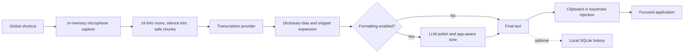

<p align="center">
  
</p>

<h1 align="center">Dictum</h1>

<p align="center">
  Open-source, local-first voice dictation for every desktop app.
  <br />
  Hold a shortcut, speak naturally, and Dictum inserts polished text at your cursor.
</p>

<p align="center">
  
  
  
  <a href="LICENSE"></a>
</p>

<p align="center">
  <a href="#installation">Installation</a> ·
  <a href="#first-run">First run</a> ·
  <a href="#using-dictum">Usage</a> ·
  <a href="#local-and-offline-transcription">Local mode</a> ·
  <a href="#development">Development</a> ·
  <a href="#troubleshooting">Troubleshooting</a>
</p>

> [!IMPORTANT]
> Dictum is currently alpha software. The source application is functional and tested in CI, but public signed installers have not been published yet. Until the first release, build it from source using the instructions below. Windows has received the most local smoke testing; macOS and Linux still need broader real-hardware testing.

Dictum is a free and open-source alternative to proprietary system-wide dictation tools such as Wispr Flow. It is not affiliated with or endorsed by Wispr Flow.

## Why Dictum?

- **Dictate anywhere.** Use one global shortcut in email, chat, documents, browsers, editors, and native applications.
- **Choose where inference happens.** Use OpenRouter, Mistral, a local vLLM server, or another OpenAI-compatible transcription provider.
- **Own your credentials.** API keys live in the operating-system credential store—not in Dictum's database or configuration file.
- **Keep audio ephemeral.** Captured audio is processed in memory and is never written to disk.
- **Control your text data.** History is local, optional, searchable, and automatically purged according to your retention setting.
- **Improve the result.** Optional formatting removes fillers, fixes grammar, adapts tone to the current app, and preserves personal vocabulary.
- **Inspect and change everything.** The desktop app, audio pipeline, provider layer, storage, and UI are MIT licensed.

Dictum itself has no subscription fee. Hosted providers may charge for inference; local mode uses your own hardware.

## Features

### Everyday dictation

- Hold-to-talk, press-to-toggle, or double-tap Right Shift
- Visual recording HUD and live microphone level
- Automatic silence trimming and quiet-speech normalization
- Long-dictation chunking with cancellation and retry handling
- Automatic language detection or an explicit language hint
- Clipboard insertion with Unicode support and a keystroke fallback
- System tray controls, pause/resume, and optional launch at login

### Writing assistance

- Optional filler removal, punctuation, grammar correction, and self-correction handling
- App-aware tone for chat, formal writing, and code-oriented applications
- Fast insert followed by an optional refined replacement
- Personal dictionary with provider context bias
- Voice snippets for reusable text
- Command mode for requests such as “make it concise” or “translate to French”
- Assistant insertion with phrases such as “ask Dictum …”

### Privacy and extensibility

- OpenRouter, native Mistral, and local vLLM providers
- Validated, data-only provider manifests for compatible services
- Optional provider fallback and zero-data-retention request flags
- Optional realtime transcription with batch fallback
- Optional end-to-end encrypted sync to a user-controlled HTTP/WebDAV endpoint
- Scriptable `dictum-cli` for PCM WAV transcription

## Platform status

| Platform | Status | Notes |
| --- | --- | --- |
| Windows 10/11 | Best tested | Uses WebView2, Windows Credential Manager, microphone privacy controls, and native text injection. |
| macOS 10.15+ | Builds in CI; hardware testing needed | Requires Microphone and Accessibility permissions. Double-tap mode also requires Input Monitoring. |
| Linux X11 | Builds in CI; best effort | Requires the listed native packages. Active-window detection and synthetic input depend on X11 tooling. |
| Linux Wayland | Limited | Wayland intentionally restricts global input and synthetic typing. A compositor-supported input portal, `ydotool`, or `wtype` integration is still needed. |

Mobile platforms are not currently supported. The mobile icon assets generated by Tauri do not indicate an Android or iOS application.

## Installation

### Option A: Download a release

The release workflow is prepared to produce Windows, macOS, and Linux packages, but there is no public signed release yet. Once releases are published, download the package for your platform from the project's **Releases** page:

| Platform | Expected package |
| --- | --- |
| Windows | NSIS `.exe` or `.msi` |
| macOS | `.dmg` |
| Debian/Ubuntu | `.deb` |
| Other supported Linux distributions | `.AppImage` |

Do not download Dictum installers from unofficial mirrors.

### Option B: Build from source

#### 1. Install the prerequisites

All platforms need:

- [Node.js](https://nodejs.org/) 20 or newer; Node.js 22 LTS is used in CI
- [Rust](https://www.rust-lang.org/tools/install) 1.81 or newer with Cargo
- Git
- The native requirements for [Tauri 2](https://v2.tauri.app/start/prerequisites/)

Platform-specific requirements:

<details>
<summary><strong>Windows</strong></summary>

Install:

1. [Microsoft C++ Build Tools](https://visualstudio.microsoft.com/visual-cpp-build-tools/) with **Desktop development with C++** selected.
2. Microsoft Edge WebView2. It is normally already installed on current Windows 10 and Windows 11 systems.
3. Rust with the MSVC toolchain:

```powershell
winget install --id Rustlang.Rustup
rustup default stable-msvc
```

Restart PowerShell after installing system tools.

</details>

<details>
<summary><strong>macOS</strong></summary>

Install Xcode Command Line Tools:

```sh
xcode-select --install
```

Then install Node.js and Rust.

</details>

<details>
<summary><strong>Ubuntu 22.04 / Debian-based Linux</strong></summary>

Install the native packages used by Dictum's CI build:

```sh
sudo apt-get update
sudo apt-get install -y \
  libwebkit2gtk-4.1-dev \
  libappindicator3-dev \
  librsvg2-dev \
  patchelf \
  libasound2-dev \
  libxdo-dev \
  libxtst-dev
```

Then install Node.js and Rust. Other distributions should use the equivalent packages from the official Tauri prerequisites guide.

</details>

Verify the toolchain:

```sh
node --version
npm --version
rustc --version
cargo --version
```

#### 2. Clone and run Dictum

```sh
git clone https://github.com/dictum-app/dictum.git
cd dictum
npm ci
npm run desktop:dev
```

The first Rust build can take several minutes. Keep the terminal open while Dictum is running; development logs appear there. The command starts both Vite and the Tauri desktop process.

To create an optimized native installer or application bundle:

```sh
npm run desktop:build
```

Build artifacts are written below `src-tauri/target/release/bundle/`.

> [!NOTE]
> `npm run dev` starts only the browser UI with mock data. Use `npm run desktop:dev` when testing microphones, global shortcuts, the keychain, the tray, or text insertion.

## First run

Dictum's onboarding guides you through the complete setup:

1. **Choose a provider.** The easiest hosted route is OpenRouter. Create an [OpenRouter API key](https://openrouter.ai/settings/keys), make sure the account or key has available credits, and paste the key into Dictum. You can instead choose local mode.
2. **Choose a microphone.** Select an input device and click **Test access**. Windows and macOS may ask for operating-system permission.
3. **Choose a shortcut.** Pick a suggestion or click **Record shortcut** and press the key combination you want. Dictum checks for conflicts before saving it.
4. **Test your voice.** Click **Start test dictation**, speak for a few seconds while watching the signal meter, then click **Stop & transcribe**.
5. **Finish setup.** Dictum stays available from the system tray and listens only while a recording shortcut is active.

The default hosted configuration is:

| Setting | Default |
| --- | --- |
| Provider | OpenRouter |
| Transcription model | `mistralai/voxtral-mini-transcribe` |
| Dictation shortcut | `Ctrl/Command + Shift + Space` |
| Shortcut behavior | Hold to talk |
| Command shortcut | `Ctrl/Command + Shift + Period` |
| Language | Automatic |
| Text formatting | Enabled |
| Local text history | Enabled, 30-day retention |
| Audio storage | Disabled and rejected by the backend |
| Provider zero-retention request | Enabled where supported |

## Using Dictum

### Dictate text

The exact behavior depends on the mode selected in Settings:

- **Hold to talk:** hold the dictation shortcut, speak, then release it.
- **Press to start/stop:** press once to begin and once again to transcribe.
- **Double-tap Right Shift:** double-tap to begin and double-tap again to stop.

Press `Escape` during recording to cancel without inserting anything. After transcription and optional formatting, Dictum pastes the result at the cursor and restores the previous clipboard contents when possible.

### Transform your previous dictation

Press the command shortcut once, speak an instruction, and press it again. For example:

- “Make it concise.”
- “Turn it into bullet points.”
- “Translate it to French.”

Command mode operates on the most recent block inserted by Dictum during the current session.

### Ask a question

Use command mode and begin with `ask Dictum` or `answer`:

```text
Ask Dictum: explain this error in one sentence.
```

The answer is inserted at the cursor without replacing the previous dictation.

### Dictionary and snippets

- Add names, product terms, acronyms, and specialized vocabulary to **Dictionary**.
- Create a snippet such as `my email` → `name@example.com` in **Snippets**.
- Speak the exact snippet trigger and Dictum expands it before formatting and insertion.
- When you edit a transcript from History, Dictum can learn changed vocabulary as automatic dictionary terms.

## Providers

| Provider | Runs where? | API key | Best for |
| --- | --- | ---: | --- |
| OpenRouter | Hosted | Required | Easiest first setup and access to the default Voxtral model. |
| Mistral | Hosted | Required | Direct Mistral transcription and realtime support. |
| Local / vLLM | Your server | No | Offline/self-hosted inference and full control over audio. |
| Custom manifest | Hosted or self-hosted | Configurable | OpenAI-compatible transcription services. |

API-key validation proves that the credential can access the provider. It does not guarantee that the account has inference credit. OpenRouter HTTP `402` errors mean the account or key has insufficient credit or spending quota.

Provider pricing and retention policies can change. Review the chosen provider's current terms before sending sensitive audio. Dictum's zero-retention option requests the provider-specific privacy flag when supported; it cannot independently guarantee a third party's behavior.

## Local and offline transcription

Dictum expects an OpenAI-compatible server with an `/audio/transcriptions` endpoint. The default local endpoint is `http://localhost:8000/v1` and the default model is `mistralai/Voxtral-Mini-3B-2507`.

One supported route is [vLLM](https://docs.vllm.ai/en/stable/). Follow its current installation guide for compatible operating systems, Python versions, and GPU hardware, then start an audio-capable server:

```sh
pip install 'vllm[audio]'
vllm serve mistralai/Voxtral-Mini-3B-2507 --port 8000
```

In Dictum:

1. Open **Settings → Transcription**.
2. Select **Local / vLLM**.
3. Set the local server to `http://localhost:8000/v1` or the HTTPS address of your self-hosted server.
4. Keep the model name aligned with the model served by vLLM.
5. Save and run a short test dictation.

Dictum does not currently download or manage model weights. That remains the responsibility of the local inference server. A remote self-hosted server is private from hosted AI vendors, but it is not offline unless it is reachable only on your local network.

For experimental realtime transcription, serve `mistralai/Voxtral-Mini-4B-Realtime-2602`, choose a realtime-capable provider, and enable **Realtime transcription** in Settings. Dictum falls back to batch transcription when no final realtime transcript is available.

## CLI

Build the standalone CLI:

```sh
cargo build --manifest-path src-tauri/Cargo.toml --release --bin dictum-cli
```

Examples on macOS/Linux:

```sh
./src-tauri/target/release/dictum-cli transcribe recording.wav
./src-tauri/target/release/dictum-cli transcribe recording.wav \
  --provider local \
  --model mistralai/Voxtral-Mini-3B-2507 \
  --endpoint http://localhost:8000/v1
./src-tauri/target/release/dictum-cli config-path
```

On Windows, use `src-tauri\target\release\dictum-cli.exe`. The v0.1 CLI accepts PCM WAV input and prints only the transcript to standard output, making it suitable for scripts.

The CLI reads Dictum's normal non-secret settings and operating-system keychain. For ephemeral automation, hosted keys can instead be supplied through `OPENROUTER_API_KEY` or `MISTRAL_API_KEY`.

Set `DICTUM_DATA_DIR` to isolate the database and configuration during tests or automation:

```sh
DICTUM_DATA_DIR=/tmp/dictum-test ./src-tauri/target/release/dictum-cli config-path
```

## How it works



The React interface communicates with a Rust backend through Tauri commands and events. Rust owns the security-sensitive and platform-sensitive work: audio capture, shortcuts, keychain access, provider requests, SQLite, text injection, the tray, and the overlay window.

### Repository layout

```text
.
├── src/                         React and TypeScript interface
│   ├── routes/                  Onboarding, home, history, settings, and HUD
│   ├── components/              Shared UI components
│   └── lib/                     Tauri bridge, types, defaults, and hotkey capture
├── src-tauri/                   Rust desktop backend
│   ├── src/audio.rs             Capture, level reporting, trimming, and chunking
│   ├── src/hotkey.rs            Global shortcuts and double-tap handling
│   ├── src/transcribe/          Batch and realtime provider implementations
│   ├── src/format.rs            Formatting, command mode, and snippets
│   ├── src/inject.rs            Clipboard and synthetic-key insertion
│   ├── src/store.rs             Settings, SQLite, providers, and history
│   ├── src/keychain.rs          Operating-system credential storage
│   ├── src/sync.rs              Encrypted self-hosted sync
│   └── src/bin/dictum-cli.rs    Scriptable CLI
├── examples/providers/          Example provider manifests
├── docs/                        Release and specification coverage notes
├── dictum-spec.md               Product and technical specification
└── .github/workflows/           Cross-platform CI and release automation
```

## Privacy and data handling

| Data | Stored where? | Sent where? |
| --- | --- | --- |
| API keys | OS Keychain, Windows Credential Manager, or Linux Secret Service | Only to the selected provider as authentication. |
| Raw audio | Memory only during the active recording | To the selected transcription provider, or only to your local server in local mode. |
| Transcript history | Local SQLite database when history is enabled | Nowhere unless encrypted sync is explicitly enabled. |
| Settings, dictionary, snippets | Local configuration/SQLite | Included in encrypted sync only when explicitly pushed. |
| App context | A coarse category such as chat, code, formal writing, or general | Included in the optional formatting prompt; the window title itself is not sent. |

Additional guarantees and boundaries:

- Dictum contains no analytics SDK, advertising SDK, remote font, crash reporter, or telemetry endpoint.
- The backend rejects any setting that requests raw-audio history storage.
- OpenRouter zero-data-retention flags are sent when that option is enabled.
- Encrypted sync derives a key with Argon2 and encrypts the payload with AES-256-GCM before upload.
- HTTP sync endpoints are accepted only on localhost; remote sync requires HTTPS.
- Provider plugins are validated JSON data and cannot execute third-party code.

See [SECURITY.md](SECURITY.md) for the security policy and vulnerability-reporting process.

## Development

### Common commands

| Command | Purpose |
| --- | --- |
| `npm ci` | Install the exact JavaScript dependency versions from the lockfile. |
| `npm run desktop:dev` | Run the complete Tauri desktop application with hot reload. |
| `npm run dev` | Run only the browser UI with mock data. |
| `npm test` | Run frontend unit and interaction tests once. |
| `npm run test:watch` | Run frontend tests in watch mode. |
| `npm run build` | Type-check and create the production frontend bundle. |
| `npm run desktop:build` | Build optimized native application packages. |
| `cargo test --manifest-path src-tauri/Cargo.toml --all-targets` | Run Rust unit and integration tests. |
| `cargo clippy --manifest-path src-tauri/Cargo.toml --all-targets -- -D warnings` | Run strict Rust linting. |
| `cargo fmt --manifest-path src-tauri/Cargo.toml -- --check` | Check Rust formatting. |

Before opening a pull request, run:

```sh
npm ci
npm run build
npm test
cargo fmt --manifest-path src-tauri/Cargo.toml -- --check
cargo clippy --manifest-path src-tauri/Cargo.toml --all-targets -- -D warnings
cargo test --manifest-path src-tauri/Cargo.toml --all-targets
```

Close the running development app before `cargo test --all-targets` on Windows; otherwise Windows may keep `dictum.exe` locked.

### Adding a provider

The simplest method is **Settings → Provider plugins**. A provider must expose OpenAI-compatible transcription and chat endpoints.

For manual installation, copy a JSON manifest based on [examples/providers/deepgram-compatible.json](examples/providers/deepgram-compatible.json) into Dictum's platform configuration directory under `providers/`:

```json
{
  "id": "example-provider",
  "name": "Example OpenAI-compatible STT",
  "baseUrl": "https://api.example.com/v1",
  "transcriptionPath": "/audio/transcriptions",
  "chatPath": "/chat/completions",
  "models": ["example-transcribe-1"],
  "supportsRealtime": false,
  "requiresApiKey": true
}
```

Provider IDs may contain only ASCII letters, numbers, hyphens, and underscores. Built-in provider IDs cannot be replaced. Select the new provider in Settings to validate and store its API key.

### Project contracts

- [dictum-spec.md](dictum-spec.md) is the product and technical specification.
- [docs/spec-coverage.md](docs/spec-coverage.md) maps specification requirements to source and verification evidence.
- [docs/releasing.md](docs/releasing.md) documents signed release preparation.
- [CONTRIBUTING.md](CONTRIBUTING.md) contains contributor expectations.

## Troubleshooting

<details>
<summary><strong>The microphone meter does not move</strong></summary>

1. Return to the microphone onboarding page or open Settings.
2. Select the same microphone that works in another application.
3. Confirm that Dictum has OS-level microphone permission.
4. On Windows, enable both microphone access and **Let desktop apps access your microphone**.
5. Speak for several seconds and watch the meter before stopping.

If the meter moves, the microphone is working; any later error is related to transcription rather than capture.

</details>

<details>
<summary><strong>“No speech was detected”</strong></summary>

The recording contained too little usable speech after silence trimming. Speak closer to the selected microphone, record for a few seconds, or enable **Whisper mode** for very quiet speech.

</details>

<details>
<summary><strong>OpenRouter says the provider quota is exhausted</strong></summary>

The API key was accepted, but OpenRouter returned HTTP `402`. Add credits, increase the key's spending limit, or use a local provider. Validating a key does not verify its inference balance.

</details>

<details>
<summary><strong>The shortcut cannot be registered</strong></summary>

The shortcut may already belong to Windows, macOS, another application, or Dictum's command mode. Choose another preset or record a different combination. Avoid ordinary unmodified letter keys.

</details>

<details>
<summary><strong>Text is transcribed but not inserted</strong></summary>

- On macOS, grant Accessibility permission to Dictum and restart the app.
- On Windows, try the alternate injection method in Settings and avoid running the target app at a higher privilege level than Dictum.
- On Linux, use an X11 session with the required input tools. Wayland support is currently limited.
- You can still copy the transcript from History while diagnosing insertion.

</details>

<details>
<summary><strong>The local provider cannot be reached</strong></summary>

Check that the server is running, the endpoint includes `/v1`, the configured model exactly matches the served model, and `/audio/transcriptions` is available. Test the provider's `/v1/models` endpoint from the same machine that runs Dictum.

</details>

<details>
<summary><strong>`npm run desktop:dev` takes a long time or appears stuck</strong></summary>

The first Rust compilation can take several minutes. A successful launch keeps the command running until Dictum closes. If compilation fails, confirm the platform-specific Tauri prerequisites, then rerun the command from the repository root.

</details>

If the problem remains, open an issue with:

- Operating system and version
- Dictum version or commit hash
- Provider and model name, without any API key
- Exact reproduction steps
- The relevant terminal error, with secrets and personal transcript text removed

## Contributing

Contributions are welcome—bug fixes, platform testing, documentation, accessibility improvements, provider compatibility, and focused feature work all help.

Please read [CONTRIBUTING.md](CONTRIBUTING.md) before opening a pull request. For substantial architectural changes, start with an issue so the approach can be discussed. Do not add telemetry, persist raw audio, log secrets, or place real credentials in fixtures.

Security vulnerabilities should not be reported in a public issue. Follow [SECURITY.md](SECURITY.md) and use a private GitHub Security Advisory.

## Roadmap and known limitations

- Publish signed Windows, macOS, and Linux installers
- Complete the real-hardware platform smoke-test matrix
- Improve Wayland input through supported desktop portals or dedicated integrations
- Make local-model installation and health checks easier
- Expand realtime-provider compatibility
- Improve accessibility and localization across the desktop UI

The detailed implementation status lives in [docs/spec-coverage.md](docs/spec-coverage.md).

## License and acknowledgements

Dictum is available under the [MIT License](LICENSE).

Dictum is built with [Tauri](https://tauri.app/), [React](https://react.dev/), and Rust. Its default speech models are from the open [Voxtral](https://mistral.ai/) family by Mistral AI. Model weights and hosted services retain their own licenses and terms.

---

<p align="center">
  Built for people who want excellent voice dictation without giving up choice or control.
</p>
