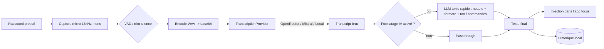

# Dictum — Spécification technique du projet

> Dictée vocale open-source, système-wide, *bring-your-own-key*. Alternative libre à Wispr Flow, propulsée par Voxtral (Mistral).
> **Statut :** spec de build v1 — à exécuter par l'équipe. Toutes les valeurs chiffrées (prix, WER, slugs de modèles, endpoints) sont des hypothèses de conception à revérifier au moment du build, car elles évoluent vite.

---

## 1. Vision & positionnement

On construit une app de bureau qui fait ce que fait Wispr Flow : tu presses un raccourci, tu parles, et un texte propre et formaté est **inséré directement là où se trouve ton curseur** — Gmail, Notion, Slack, VS Code, un champ de formulaire web, n'importe où. Le cycle « parler → texte poli » vise **< 1,5 s** en conditions normales.

**Ce qui nous rend meilleurs que Wispr Flow :**

| Axe | Wispr Flow | Dictum |
|---|---|---|
| Modèle éco | Cloud propriétaire, abonnement (~12–15 $/mois) | BYO-key, tu paies l'inférence au coût réel (~0,003 $/min) |
| Offline | Impossible (cloud-only) | Backend local optionnel (Voxtral open-weights via vLLM) |
| Provider | Verrouillé | OpenRouter / Mistral / local, interchangeables |
| Données | Cloud (mode zéro-rétention en Pro) | Local-first par défaut, clé dans le keychain OS, zéro télémétrie |
| Extensibilité | Fermé | Open source (MIT), système de providers/plugins |
| Coût pour l'utilisateur | Récurrent | Le prix de sa clé API, point |

**Non-objectifs v1 :** mobile (iOS/Android), sync multi-appareils cloud, dashboard analytics d'équipe, conformité HIPAA. On les met dans la roadmap, pas dans le MVP.

---

## 2. Décision modèle & provider (résumé exécutable)

| Modèle | Slug (OpenRouter) | Prix ~ | WER FLEURS ~ | Endpoint | Rôle dans Dictum |
|---|---|---|---|---|---|
| **Voxtral Mini Transcribe** | `mistralai/voxtral-mini-transcribe` | ~0,002–0,003 $/min | ~4–5,5 % | `/audio/transcriptions` | **Défaut** — le meilleur latence/coût |
| Voxtral Small 24B | `mistralai/voxtral-small-24b-2507` | ~0,006 $/min | ~5,1 % | `/chat/completions` + `input_audio` | Mode « qualité / smart » (audio-LLM : transcrit + formate en un appel) |
| Voxtral Mini TTS | `mistralai/voxtral-mini-tts-2603` | — | N/A | `/audio/speech` | ❌ **Jamais** — c'est du text-to-speech |
| Voxtral Mini Transcribe V2 | `voxtral-mini-2602` (natif Mistral) | ~0,003 $/min | ~4 % | `/audio/transcriptions` | Défaut si dispo côté provider natif (diarisation, timestamps) |
| Voxtral Realtime | poids Apache-2.0 `Voxtral-Mini-4B-Realtime-2602` | ~0,006 $/min (API) | ~4 % | WebSocket streaming | **Phase 2** — mode dictée live sub-200 ms |

**Règle produit :** le défaut, c'est **push-to-talk + Mini Transcribe** (le plus simple, marche sur OpenRouter aujourd'hui, latence minimale). Le streaming Realtime est un mode avancé, pas le MVP.

**Contrainte technique importante :** l'encodeur Voxtral est de type Whisper → il attend des chunks audio de **≤ 30 s**. Pour la dictée classique une énoncé fait < 30 s ; au-delà, on découpe au silence (VAD) en morceaux ≤ 30 s et on concatène.

---

## 3. Architecture — vue d'ensemble



**Pipeline en 2 étages (clé de la qualité « Wispr-like ») :**
1. **Transcription** — audio → texte brut (déjà ponctué par Voxtral). Rapide, obligatoire.
2. **Formatage IA (optionnel, togglable)** — texte brut → LLM texte bon marché (via la même clé OpenRouter, ex. `mistralai/ministral-8b` ou `mistralai/mistral-small`) pour : retirer les *fillers* (« euh », « bah »), corriger la grammaire, adapter le ton au contexte de l'app, ou appliquer une commande (« mets ça en liste à puces »).

Garder ces deux étages **séparés et le 2e désactivable** = on protège la latence quand l'utilisateur veut juste du texte rapide. Le mode « Small » (audio-LLM) fusionne les deux étages en un appel : à proposer comme option « max qualité » quand la latence importe moins.

---

## 4. Stack technique

**Décision : Tauri v2** (backend Rust + frontend web).

Justification : c'est un utilitaire toujours-actif, sensible à la latence, avec des besoins natifs lourds (raccourci global, capture audio, injection clavier système). Tout ça est propre et performant en Rust, et Tauri produit un binaire léger (vs Electron qui embarque Chromium, ~150 Mo de RAM à vide). Les crates Rust nécessaires sont matures et à faible surface. Le frontend reste en TypeScript/React (que l'équipe maîtrise).

> **Fallback si l'équipe refuse Rust :** Electron + `nut.js`/`node-global-key-listener` + `naudiodon`. Plus simple à démarrer 100 % en JS, mais binaire lourd, permissions natives plus pénibles, moins « utilitaire natif ». On recommande fortement Tauri quand même.

**Briques :**

| Besoin | Rust (Tauri) | Notes |
|---|---|---|
| Raccourci global | `tauri-plugin-global-shortcut` ou `global-hotkey` / `rdev` | `rdev` pour détecter le double-tap (ex. RShift×2) |
| Capture audio | `cpal` | Capturer en **16 kHz mono** pour minimiser le payload |
| VAD / trim silence | `webrtc-vad` (binding) ou énergie simple | Coupe le blanc avant/après, découpe > 30 s |
| Injection texte | `arboard` (clipboard) + `enigo` (keystrokes) | Voir §7.5 pour la stratégie |
| Keychain | `keyring` crate / `tauri-plugin-stronghold` | Clé API **jamais** en clair |
| Stockage | `rusqlite` (SQLite) | Settings, dictionnaire, snippets, historique |
| HTTP | `reqwest` | Appels providers + retry |
| Frontend | React + Vite + TypeScript + Tailwind | Onboarding, settings, historique, overlay |

> **Remix : non.** Remix est orienté SSR web, inutile ici. React + Vite suffit pour des fenêtres desktop. (L'expertise React est réutilisée, la plomberie Remix ne l'est pas.)

---

## 5. Liste des features (priorisée)

### P0 — MVP (« ça marche, de A à Z »)
- [ ] **Raccourci global** push-to-talk (hold-to-talk + toggle). Défaut proposé : `CmdOrCtrl+Shift+Space` ou double-tap `RShift`.
- [ ] **Capture micro** 16 kHz mono avec indicateur de niveau + VAD/trim.
- [ ] **Transcription** via `TranscriptionProvider` → preset **OpenRouter + Voxtral Mini Transcribe**.
- [ ] **Injection texte** dans l'app focus (stratégie clipboard-paste, §7.5).
- [ ] **Overlay/HUD** : petite fenêtre transparente always-on-top montrant l'état (idle / écoute / transcription / erreur) + texte live.
- [ ] **Tray / menu-bar** : présence permanente, pause/reprise, ouvrir settings, quitter.
- [ ] **Settings** : clé API (validée par un appel test), choix modèle, provider, raccourci, langue, périphérique micro.
- [ ] **Stockage sécurisé de la clé** (keychain OS).
- [ ] **Onboarding first-run** avec gestion des permissions (micro + Accessibilité macOS).
- [ ] **Auto-start au login** (togglable).

**Acceptance MVP :** un nouvel utilisateur installe, colle sa clé OpenRouter, accorde 2 permissions, et dicte une phrase dans Notion en < 2 s, sans toucher à un fichier de config.

### P1 — Parité Wispr Flow
- [ ] **Formatage IA** (2e étage togglable) : suppression fillers, ponctuation/casse, correction grammaire.
- [ ] **Adaptation de ton par app** : formel dans Gmail, casual dans Slack, code-aware dans VS Code (détecter l'app focus → injecter un system prompt adapté).
- [ ] **Gestion des auto-corrections** : « rendez-vous mardi, non attends, vendredi » → « Rendez-vous vendredi » (géré par le 2e étage).
- [ ] **Dictionnaire personnel** : mots/noms/jargon/acronymes ; apprentissage auto quand l'utilisateur corrige (injecté comme *context biasing* / prompt).
- [ ] **Snippets / raccourcis vocaux** : un cue parlé → insère un texte long (« mon email » → adresse ; « standup » → template).
- [ ] **Command Mode** : instruction en langage naturel appliquée au dernier bloc dicté (« rends ça plus concis », « traduis en anglais », « mets en liste »).
- [ ] **Multilingue + auto-détection** avec code-switching mid-phrase (Voxtral gère nativement).
- [ ] **Whisper Mode** : parler à faible volume, gain/normalisation compensatoire.
- [ ] **Historique des dictées** : liste consultable, recopier, supprimer, purge auto (rétention configurable).
- [ ] **Affichage du coût** estimé par dictée / cumul (durée audio × tarif modèle).

### P2 — Au-delà de Wispr
- [ ] **Backend local** self-hosted (Voxtral Mini/Realtime via vLLM) → offline, zéro coût par requête.
- [ ] **Mode Realtime streaming** (WebSocket, sub-200 ms) : texte qui apparaît pendant qu'on parle.
- [ ] **Système de providers/plugins** ouvert (ajouter Deepgram, Whisper local, etc.).
- [ ] **Sync optionnelle** self-hostable (settings/dictionnaire/snippets) — chiffrée, opt-in, jamais un serveur central obligatoire.
- [ ] **CLI** (`dictum transcribe file.wav`, scriptable).
- [ ] **Intégration assistants** (poser une question à un LLM par la voix et coller la réponse).

---

## 6. Specs détaillées par composant

### 6.1 Gestionnaire de raccourci global (`hotkey.rs`)
- Enregistre un ou plusieurs raccourcis système-wide (fonctionne même app non focus).
- Supporte 3 modes : **hold-to-talk** (presser = écoute, relâcher = envoi), **toggle** (1er appui start, 2e stop), **double-tap** (RShift×2 pour start, ×2 pour stop) — ce dernier nécessite `rdev` (bas niveau).
- Débounce anti double-déclenchement.
- Émet des events Tauri vers le frontend : `recording:start`, `recording:stop`, `recording:cancel` (Échap).
- **Edge cases :** conflit avec un raccourci système existant → validation à la config ; permission « Input Monitoring » requise sur macOS pour le bas niveau.

### 6.2 Capture audio + VAD (`audio.rs`)
- `cpal` : ouvrir le périphérique par défaut (ou celui choisi), format **16 kHz / mono / f32 → PCM16**.
- Buffer en mémoire pendant l'écoute ; à l'arrêt, **trim silence** début/fin, découpe en chunks ≤ 30 s si nécessaire.
- Exposer le **niveau RMS** au frontend pour l'animation de l'overlay.
- Whisper Mode = boost de gain + normalisation avant envoi.
- Sortie : `Vec<Chunk>` (WAV en mémoire) prêts à encoder base64.
- **Edge cases :** micro débranché en cours ; permission micro refusée ; énoncé vide (silence total) → ne rien envoyer.

### 6.3 Service de transcription — abstraction provider (`transcribe/`)

Trait commun :

```rust
#[async_trait]
pub trait TranscriptionProvider {
    async fn transcribe(&self, audio: &AudioChunk, opts: &TranscribeOpts)
        -> Result<Transcript, TranscribeError>;
    fn id(&self) -> &'static str;        // "openrouter" | "mistral" | "local"
    fn supports_realtime(&self) -> bool; // false pour OpenRouter, true pour local/mistral realtime
}

pub struct TranscribeOpts {
    pub model: String,          // "mistralai/voxtral-mini-transcribe"
    pub language: Option<String>, // None = auto-détection
    pub biasing: Vec<String>,   // termes du dictionnaire perso
}
```

Implémentations :
- `openrouter.rs` — **défaut**. Détails d'appel en §9.
- `mistral.rs` — natif ; débloque V2 (diarisation, timestamps) et Realtime.
- `local.rs` — POST vers un endpoint vLLM local (`http://localhost:8000/v1/...`) exposant Voxtral.

Sélection via config `provider` + `model`. Le trait garde la logique métier (hotkey→audio→inject) totalement agnostique.

### 6.4 Post-processeur / formatage IA (`format.rs`)
- Optionnel, désactivable. Prend le transcript brut + le **contexte de l'app focus** + le **dictionnaire perso** et appelle un LLM texte rapide (même clé OpenRouter).
- Rôles configurables : `removeFillers`, `fixGrammar`, `tone: auto|formal|casual|code`, `applyCommand`.
- System prompt paramétré par contexte (détecté via l'app au premier plan) : ex. contexte `code` → « ne reformule pas, respecte la syntaxe, garde les noms de fichiers/symboles intacts ».
- **Command Mode** : si l'utilisateur est en mode commande, l'instruction dictée est appliquée au *dernier bloc inséré* (qu'on garde en mémoire), pas insérée comme texte.
- **Budget latence :** cet étage ajoute ~200–600 ms. Le rendre asynchrone/optionnel ; possibilité d'insérer le brut immédiatement puis de le remplacer par la version formatée (mode « fast insert + refine »).

### 6.5 Moteur d'injection de texte (`inject.rs`)

**Le point techniquement le plus délicat.** Stratégie recommandée :

- **Primaire — clipboard paste :**
  1. sauvegarder le contenu actuel du presse-papier,
  2. y mettre le texte final,
  3. simuler `Cmd/Ctrl+V`,
  4. attendre ~50–100 ms,
  5. restaurer l'ancien presse-papier.
  → Rapide, fiable dans quasiment toutes les apps, gère les caractères spéciaux/unicode.
- **Fallback — frappe synthétique** (`enigo`, caractère par caractère) pour les apps qui bloquent le collage ou quand préserver le presse-papier est critique. Plus lent, peut buter sur certains caractères.
- Choix exposé en settings (`injection: clipboard | keystroke`).

**Par OS :**
- **macOS :** permission **Accessibilité** obligatoire (pour paste ET keystrokes). Prévoir un deep-link vers *System Settings → Privacy → Accessibility* dans l'onboarding.
- **Windows :** `SendInput` via `enigo` ; RAS majeur.
- **Linux X11 :** OK via `enigo`. **Wayland : restreint** — l'injection synthétique est bloquée par sécurité ; nécessite `wtype`/`ydotool` ou un portail d'input. **→ X11-first en v1, Wayland en risque connu (§17).**

### 6.6 Overlay / HUD (`src/routes/overlay`)
- Fenêtre Tauri : transparente, sans bordure, always-on-top, non focusable, click-through hors zone active.
- États : *idle* (caché/discret), *listening* (waveform animée depuis le RMS), *transcribing* (spinner), *result* (bref aperçu), *error* (message + code).
- Positionnable (bas-centre par défaut). Escape = annuler.

### 6.7 Settings & stockage sécurisé (`store.rs`, `keychain.rs`)
- Settings dans SQLite ; **clé API dans le keychain OS**, jamais dans SQLite/config.
- Validation de la clé à la saisie via un appel test (ex. lister les modèles ou une transcription d'1 s de silence) → feedback immédiat.

### 6.8 Dictionnaire & snippets (`store.rs`)
- Dictionnaire : liste de termes ; injectés soit comme *context biasing* (si le provider le supporte), soit dans le prompt du formateur, soit en post-correction (remplacement fuzzy).
- Apprentissage auto : quand l'utilisateur corrige un mot juste après une dictée, proposer de l'ajouter.
- Snippets : `{ trigger, expansion }` ; détectés dans le transcript et remplacés avant injection.

### 6.9 Historique (`store.rs`)
- Chaque dictée : texte, timestamp, app cible, durée audio, coût estimé, modèle.
- Rétention configurable (défaut 30 j), purge auto. **Audio jamais persisté par défaut** (privacy).

---

## 7. Modèle de données (SQLite)

```sql
CREATE TABLE settings (
  key   TEXT PRIMARY KEY,
  value TEXT NOT NULL           -- JSON
);

CREATE TABLE dictionary (
  id         INTEGER PRIMARY KEY,
  term       TEXT NOT NULL UNIQUE,
  created_at INTEGER NOT NULL,
  source     TEXT                -- 'manual' | 'auto'
);

CREATE TABLE snippets (
  id        INTEGER PRIMARY KEY,
  trigger   TEXT NOT NULL UNIQUE,
  expansion TEXT NOT NULL
);

CREATE TABLE history (
  id           INTEGER PRIMARY KEY,
  text         TEXT NOT NULL,
  app_bundle   TEXT,             -- app cible détectée
  audio_ms     INTEGER,
  cost_usd     REAL,
  model        TEXT,
  created_at   INTEGER NOT NULL
);
```

**Clé API :** stockée via le keychain (`service = "com.dictum.app"`, `account = provider`), pas en base.

---

## 8. Config utilisateur (exemple)

Fichier `~/.config/dictum/config.json` (la clé API **n'y est pas**) :

```json
{
  "provider": "openrouter",
  "model": "mistralai/voxtral-mini-transcribe",
  "hotkey": { "mode": "hold", "combo": "CmdOrCtrl+Shift+Space" },
  "language": "auto",
  "injection": "clipboard",
  "formatting": {
    "enabled": true,
    "model": "mistralai/ministral-8b",
    "removeFillers": true,
    "fixGrammar": true,
    "tone": "auto"
  },
  "whisperMode": false,
  "history": { "enabled": true, "retentionDays": 30, "storeAudio": false }
}
```

---

## 9. Détails d'intégration API

> Vérifier les slugs et endpoints exacts dans la doc OpenRouter/Mistral au moment du build — ils bougent. Base URL OpenRouter : `https://openrouter.ai/api/v1`.

### 9.1 Défaut — Voxtral Mini Transcribe (endpoint transcription)

```bash
AUDIO_B64=$(base64 < clip.wav | tr -d '\n')
curl https://openrouter.ai/api/v1/audio/transcriptions \
  -H "Authorization: Bearer $OPENROUTER_API_KEY" \
  -H "Content-Type: application/json" \
  -d '{
    "model": "mistralai/voxtral-mini-transcribe",
    "input_audio": { "data": "'"$AUDIO_B64"'", "format": "wav" },
    "language": "fr"
  }'
```

### 9.2 Mode qualité — Voxtral Small (chat completions + audio)

```ts
const res = await fetch("https://openrouter.ai/api/v1/chat/completions", {
  method: "POST",
  headers: {
    Authorization: `Bearer ${apiKey}`,
    "Content-Type": "application/json",
  },
  body: JSON.stringify({
    model: "mistralai/voxtral-small-24b-2507",
    messages: [{
      role: "user",
      content: [
        { type: "input_audio", input_audio: { data: audioB64, format: "wav" } },
        { type: "text", text: "Transcris fidèlement. Ponctue, retire les hésitations. Renvoie uniquement le texte." },
      ],
    }],
  }),
});
```

### 9.3 Étage formatage (LLM texte rapide)

```ts
// même clé, modèle texte bon marché
body: JSON.stringify({
  model: "mistralai/ministral-8b",
  messages: [
    { role: "system", content: buildSystemPrompt(appContext, dictionary) },
    { role: "user", content: rawTranscript },
  ],
})
```

### 9.4 Robustesse
- **Retry** avec backoff exponentiel (réseau, 429, 5xx). OpenRouter ne facture pas les requêtes échouées.
- **Timeout** agressif (ex. 10 s) + annulation propre si l'utilisateur relance.
- **Erreurs mappées** vers l'overlay (clé invalide, quota, réseau, audio trop long).
- **Coût** : `audio_ms/60000 * tarif_modèle` → affiché et loggé dans l'historique.
- **Fallback provider** (optionnel) : si OpenRouter échoue et qu'une clé Mistral existe, réessayer sur Mistral.

---

## 10. Flux UX clés

**First-run onboarding :**
1. Bienvenue.
2. Coller la clé OpenRouter → validation par appel test → ✅/❌ immédiat.
3. Permission micro (déclenchée in-context).
4. (macOS) Permission Accessibilité, avec deep-link guidé.
5. Choisir le raccourci (avec test de conflit).
6. Choisir la langue (ou auto).
7. Dictée d'essai dans un champ sandbox.
8. Réduit dans la tray. Fini.

**Flux de dictée :** raccourci → overlay « écoute » + waveform → relâche → « transcription » → (formatage) → texte inséré dans l'app focus → entrée historique. Escape à tout moment = annulation.

**Command Mode :** raccourci dédié (ou préfixe vocal) → l'énoncé est traité comme instruction sur le dernier bloc inséré.

---

## 11. Sécurité & confidentialité
- **Local-first** : rien ne quitte la machine sauf l'audio envoyé au provider choisi par l'utilisateur.
- Clé API dans le **keychain OS** ; jamais loggée, jamais en config claire.
- **Audio non persisté** par défaut ; historique = texte seulement, purge auto.
- **Zéro télémétrie** par défaut (si un jour analytics opt-in : anonyme et local-first).
- Option « zéro-rétention » côté provider quand supportée (header/param dédié).
- Backend local pour un mode 100 % offline.

---

## 12. Notes cross-platform

| | macOS | Windows | Linux |
|---|---|---|---|
| Injection | Accessibilité requise | `SendInput` OK | X11 OK ; **Wayland restreint** |
| Raccourci bas niveau | Input Monitoring requis | OK | OK (X11) |
| Micro | Permission TCC | Permission | Généralement OK |
| Packaging | `.dmg` + notarisation Apple | `.msi`/NSIS + signature | `.AppImage`/`.deb` |

**Priorité v1 :** macOS + Windows d'abord ; Linux X11 en best-effort ; Wayland documenté comme limitation.

---

## 13. Structure du repo

```
dictum/
├── src-tauri/
│   ├── src/
│   │   ├── main.rs
│   │   ├── hotkey.rs
│   │   ├── audio.rs
│   │   ├── transcribe/
│   │   │   ├── mod.rs          # trait TranscriptionProvider
│   │   │   ├── openrouter.rs
│   │   │   ├── mistral.rs
│   │   │   └── local.rs
│   │   ├── format.rs
│   │   ├── inject.rs
│   │   ├── store.rs            # rusqlite
│   │   ├── keychain.rs
│   │   └── commands.rs         # #[tauri::command] exposés au frontend
│   ├── tauri.conf.json
│   └── Cargo.toml
├── src/                        # React + Vite + TS
│   ├── routes/
│   │   ├── onboarding/
│   │   ├── settings/
│   │   ├── history/
│   │   └── overlay/
│   ├── components/
│   └── lib/
├── package.json
├── README.md
└── SPEC.md                     # ce document
```

---

## 14. Build, packaging, distribution
- `tauri build` par plateforme (CI matrix GitHub Actions : macos, windows, ubuntu).
- **Auto-update** via `tauri-plugin-updater` (manifest signé).
- **Signature** : notarisation macOS (certif Apple Developer), signature Authenticode Windows.
- Releases GitHub + Homebrew cask / winget (nice-to-have).

---

## 15. Roadmap / jalons

| Jalon | Contenu | Critère de sortie |
|---|---|---|
| **M1 — Spike** | Hotkey → capture → OpenRouter Mini Transcribe → paste, en dur, une plateforme | Dicter dans une app, voir le texte |
| **M2 — MVP (P0)** | Onboarding, settings, keychain, tray, overlay, permissions, provider trait | Un inconnu installe et dicte sans config |
| **M3 — Parité (P1)** | Formatage IA, dictionnaire, snippets, Command Mode, historique, multilingue | Parité fonctionnelle Wispr Flow |
| **M4 — Cross-platform** | macOS + Windows signés + auto-update | Installeurs publics |
| **M5 — Au-delà (P2)** | Backend local, Realtime streaming, plugins | Mode offline + streaming live |

---

## 16. Décisions ouvertes / risques

1. **Injection Wayland** — bloquée nativement ; X11-first, décider d'une approche (`ydotool`/portail) pour Wayland plus tard. *Risque élevé sur Linux.*
2. **Couverture exacte de Voxtral sur l'endpoint `/audio/transcriptions` d'OpenRouter** — confirmer le slug + endpoint au build ; sinon basculer sur `/chat/completions` + `input_audio` (fonctionne pour Small), ou provider Mistral direct.
3. **Budget latence du 2e étage** — décider fast-insert-then-refine vs attendre le formatage. Mesurer end-to-end tôt.
4. **Détection de l'app focus** par OS (pour le ton contextuel) — API différentes ; encapsuler.
5. **Realtime = infra différente** (WebSocket, probablement Mistral natif, pas OpenRouter) — le sortir du chemin MVP.
6. **Double-tap RShift** exige de l'input bas niveau (permissions supplémentaires) — dégrader gracieusement vers un combo classique si refusé.

---

## 17. Licence
- **App : MIT** (adoption maximale).
- **Poids Voxtral : Apache-2.0** (compatible pour le backend local).
- Créditer Mistral/Voxtral et OpenRouter dans le README.

---

### Annexe — mémo modèles
- **Défaut = Voxtral Mini Transcribe** : transcription-optimisé → latence min, ~0,003 $/min, WER ~4–5 %, endpoint transcription propre.
- **Qualité = Voxtral Small 24B** : SOTA short-form, audio-LLM (transcrit+formate en un appel), ~2× le prix.
- **TTS = interdit** : c'est du texte→audio.
- **Realtime (Phase 2)** : streaming sub-200 ms, poids open Apache-2.0, idéal pour la dictée live.
- **Ne pas coder le provider en dur** : trait `TranscriptionProvider` → OpenRouter (défaut) / Mistral (natif) / Local (offline).
